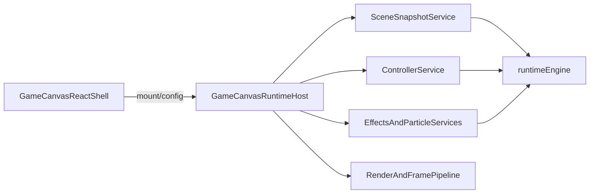

# Runtime Host Endgame Plan

## Goal

Move snapshot-producing canvas/runtime adapters out of React and into long-lived host-owned services, so `client/src/components/GameCanvas.tsx` becomes mostly a shell around the DOM canvas, overlay composition, and host lifecycle.

Current reality after the latest runtime and renderer changes:

- `GameCanvasRuntimeHost` owns the `runtimeEngine` frame pipeline, render context storage, typed snapshots, frame bindings, and controller refs in `client/src/engine/runtime/GameCanvasRuntimeHost.ts`.
- `useGameCanvasFramePipeline` mounts the host pipeline and only keeps the React frame-loop bridge alive in `client/src/engine/runtime/useGameCanvasFramePipeline.ts`.
- `useGameCanvasControllerRuntime` already consumes host-owned refs and host-owned build state, but input handling and some controller snapshot shaping are still React hook producers.
- Ambient effects, ambient audio, and particle production now live behind `GameCanvasRuntimeHost`.
- Pointer tracking and build/repair target selection for render/input/mobile taps now live behind `GameCanvasRuntimeHost`.
- React still produces scene and controller snapshots in `GameCanvas`, then synchronizes them directly through host configuration methods.
- Cloud/grass interpolation, falling-tree animation, projectile presentation, world lookup caches, the day/night mask runtime, and viewport/entity filtering now live behind `GameCanvasRuntimeHost`.
- Render-context assembly now lives behind `GameCanvasRuntimeHost.configureRenderContextFromSnapshots()`, with the React render hook reduced to lifecycle/config glue.
- The procedural world renderer cache/transition optimizations are orthogonal to this plan. They improve render hot paths but do not materially change runtime ownership.

## End-State Shape

## Current Boundary Map

Still React-produced:

- Scene snapshot: `useGameCanvasSceneRuntime`, `useGameScreenWorldTables`, and `useUITable`.
- Controller snapshot: `useGameCanvasControllerRuntime`, `useGameCanvasInteractionRuntime`, and `useInputHandler`.
- Render config glue: `configureGameCanvasRenderRuntime` passes stable config into host-owned render-context assembly.

Already host-owned enough to build on:

- Runtime frame pipeline and frame callbacks in `GameCanvasRuntimeHost`.
- Controller mutable refs returned by `host.getControllerRefs()`.
- Frame binding execution and live pose refresh in `GameCanvasRuntimeHost`.
- Snapshot storage/accessors for scene, controller, particles, ambient effects, and render context.
- The render pipeline entrypoint, via `host.renderFrame()` calling `renderGameCanvasFrame()`.

## Recommended Order

The old stage order is still broadly valid, but the next useful slices are narrower than before:

1. Collapse sync-only adapters.
2. Move adjunct controller state.
3. Convert ambient/runtime effects to host services.
4. Move isolated particle producers into a host service.
5. Move render-context assembly behind host configuration.
6. Extract controller core services.
7. Migrate scene production last.

## Stage 1: Remove Sync-Only Adapters

Replace the remaining React-only sync glue with direct host configuration methods first, because this is now the lowest-risk cleanup slice.

Files:

- Deleted sync-only host configuration adapter
- Deleted controller frame-binding bridge adapter
- `client/src/components/GameCanvas.tsx`
- `client/src/engine/runtime/GameCanvasRuntimeHost.ts`

Plan:

- Completed: inline the former sync-only adapter by calling host `configure*()` methods from `GameCanvas`.
- Completed: collapse the former controller bridge by moving frame binding construction to `GameCanvasRuntimeHost`.
- Keep `GameCanvas` as the mount/configuration caller, but remove adapter hooks whose only job is forwarding already-shaped data.
- Do not change scene/controller/particle production behavior in this stage.

## Stage 2: Move Tiny Controller Adjunct State Behind Host Services

Pull the small controller-owned adjuncts into host-managed controller services before touching the hardest controller logic.

Files:

- `client/src/engine/react/useGameCanvasControllerRuntime.ts`
- `client/src/hooks/useGameCanvasUpgradeMenuState.ts`
- `client/src/hooks/useGameCanvasHostState.ts`
- `client/src/engine/runtime/assembleGameCanvasControllerSnapshot.ts`
- `client/src/engine/runtime/GameCanvasRuntimeHost.ts`

Plan:

- Completed: turn upgrade menu state and host-state shaping into host/controller-owned mutable services.
- Completed: reduce the controller snapshot to service outputs instead of React-local hook composition.
- Completed: preserve the current typed controller snapshot contract while swapping who produces it.
- Keep `assembleGameCanvasControllerSnapshot` as the compatibility boundary until build/interaction extraction is ready.

## Stage 3: Move Ambient/Effects Services Out of React

The ambient bridge has already been narrowed and now reads host snapshots, so it is the best next producer migration after sync glue and controller adjuncts.

Files:

- Deleted React ambient effects adapter
- `client/src/engine/runtime/useGameCanvasRuntimeEffects.ts`
- Deleted React ambient environment adapter
- `client/src/engine/runtime/gameplayEventEffectsRuntime.ts`
- `client/src/engine/runtime/GameCanvasRuntimeHost.ts`

Plan:

- Completed: convert non-audio ambient/effects behavior from hook-backed bridges into host-owned services with explicit `start/stop/update` lifecycles.
- Completed: move flashlight aim sync, burn sound bookkeeping, reducer feedback handlers, arrow break effects, viewport sync, thunder events, chunk rain transitions, and auto-action callbacks into `GameCanvasAmbientEffectsRuntime`.
- Completed: drive the host-owned ambient/effects service from `GameCanvasRuntimeHost` frame preparation instead of from a React render hook.
- Completed: extract the ambient audio engine formerly behind `useAmbientSounds` into `AmbientSoundRuntime`, driven by `GameCanvasRuntimeHost` frame preparation.
- Reuse existing non-React service patterns from `client/src/engine/runtime/gameplaySubscriptionsRuntime.ts` and `client/src/engine/runtime/worldChunkDataRuntime.ts`.
- Leave only effect configuration and browser lifecycle attachment in React if needed.

## Stage 4: Move Particle Production Into Host-Owned Services

Particle production is now isolated from ambient/runtime effects, making this stage more mechanical than it was when the plan was first written.

Files:

- `client/src/engine/runtime/useGameCanvasParticleRuntime.ts`
- `client/src/engine/runtime/GameCanvasRuntimeHost.ts`
- Particle hooks under `client/src/hooks/use*Particles.ts`

Plan:

- Completed: replace the hook-driven particle snapshot with a host-owned particle service consuming scene/controller state.
- Completed: keep the existing typed particle snapshot as the host-facing render contract.
- Completed: preserve the current `renderParticles` and `computeCampfireFireOverlayEmitters` surface so render-context assembly can keep reading the same snapshot shape during migration.
- Completed: delete the isolated `useGameCanvasParticleRuntime` React adapter.
- Move one particle family at a time only if the particle hooks have materially different lifecycle behavior.

## Stage 5: Move Render-Context Assembly Behind Host Configuration

React no longer assembles the large render input bag. `configureGameCanvasRenderRuntime` passes stable config/assets/refs into host-owned render-context assembly.

Files:

- `client/src/engine/runtime/configureGameCanvasRenderRuntime.ts`
- `client/src/engine/runtime/GameCanvasRuntimeHost.ts`
- `client/src/components/GameCanvas.tsx`
- `client/src/engine/frame/renderGameCanvasFrame.ts`

Plan:

- Completed: push render-context assembly into the host so React passes only stable config/assets/DOM refs.
- Completed: keep browser-bound assets and DOM refs configured from React, but stop recomputing the full render context in a hook.
- Completed: split the render input bag into stable host config, live host snapshots/refs, and per-frame render parameters before moving it wholesale.
- Completed: render hook is now tiny config/lifecycle glue around host-owned context assembly.

## Stage 6: Migrate Core Controller Behavior

This remains one of the largest ownership seams and should happen after the thinner sync/effects/particle/render slices.

Files:

- Deleted build-state adapter
- `client/src/engine/react/useGameCanvasInteractionRuntime.ts`
- Deleted frame-state adapter
- `client/src/engine/runtime/movementPredictionRuntime.ts`
- `client/src/engine/react/useGameCanvasControllerRuntime.ts`

Plan:

- Extract build/interaction logic into imperative controller services owned by the host.
- Use the existing runtime-owned movement precedent in `client/src/engine/runtime/movementPredictionRuntime.ts` as the design model.
- Completed: remove `useGameCanvasFrameRuntimeState` by moving frame-state ref writes into `GameCanvasRuntimeHost.configureControllerFrameRuntimeState()`.
- Completed: add host-owned pointer tracking for frame rendering, input actions, ambient effects, scene mask frame overrides, and mobile tap handling.
- Completed: remove the scene mouse-position hook; scene mask drawing now gets live pointer coordinates through host-owned frame refs.
- Completed: move build/repair targeting and highlight selection into `GameCanvasBuildTargetingRuntime`, so render and right-click repair actions consume host-owned target refs.
- Completed: delete the old mouse-position and build-targeting React hooks.
- Completed: move interaction target scanning into `interactionTargetRuntime`, so render labels and input actions consume host-owned target refs instead of a React state-producing hook.
- Completed: remove the remote-player interpolation wrapper; frame assembly now consumes the existing runtime interpolation singleton directly.
- Completed: move building placement mode, placement reducer calls, equipment checks, spatial indexes, and triangle-shape prediction into `BuildingPlacementRuntime`, with React only subscribing for overlay updates.
- Completed: remove the build-state React adapter; controller build state is assembled through `GameCanvasRuntimeHost.configureControllerBuildRuntimeState()`.
- In progress: move input timers/actions and controller snapshot production out of React hooks.
- Keep React limited to event capture and minimal subscriptions.

## Stage 7: Migrate Scene Production Last

This is the heaviest and riskiest migration because it still owns table reads and frame assembly.

Files:

- `client/src/engine/react/useGameCanvasSceneRuntime.ts`
- `client/src/engine/runtime/assembleGameCanvasSceneSnapshot.ts`
- Deleted frame assembly adapter
- `client/src/engine/react/useGameplayTableStateRegistry.ts`
- `client/src/engine/adapters/spacetime/createGameplayTableBindings.ts`
- `client/src/engine/runtimeEngine.ts`

Plan:

- Move scene producers toward long-lived runtime stores/services backed by `runtimeEngine` rather than React hooks.
- Replace hook-local interpolation and lookup production with host/service-owned caches or runtimeEngine slices.
- Completed: move cloud and grass interpolation into host-owned `CloudInterpolationRuntime` and `GrassInterpolationRuntime`; React scene assembly consumes their existing map contracts.
- Completed: move falling-tree animation into host-owned `FallingTreeAnimationRuntime`, preserving the existing `isTreeFalling` and `getFallProgress` render contracts.
- Completed: move projectile presentation into host-owned `ProjectilePresentationRuntime`, including resolved-projectile retention, optimistic/authoritative dedupe, and render tracking cleanup.
- Completed: move visible world tiles, water/shore lookups, hot spring/quarry detection, and shore-distance cache into host-owned `WorldLookupRuntime`.
- Completed: move day/night overlay and mask drawing into host-owned `DayNightCycleRuntime`, preserving `overlayRgba`, `maskCanvasRef`, and `redrawMask` contracts.
- Completed: move viewport culling, visible entity maps, and Y-sort cache production into host-owned `EntityFilteringRuntime`, deleting the React entity-filtering adapter and hook.
- Completed: move frame assembly composition into `GameCanvasRuntimeHost.configureFrameAssemblyRuntime()`, deleting the React frame assembly adapter.
- Keep `assembleGameCanvasSceneSnapshot` as the contract-preserving adapter while migrating one producer group at a time.
- Expect this stage to require the most coordination with table binding/state registry architecture.

## Risks

- `client/src/engine/runtimeEngine.ts` is a global singleton, so ownership boundaries need discipline to avoid accidental coupling.
- `client/src/engine/runtime/useGameplayTableStateRegistry.ts` and `client/src/engine/adapters/spacetime/createGameplayTableBindings.ts` still anchor a lot of gameplay state flow in React-shaped setters/refs.
- Controller/build/interaction migration is behavior-heavy and should not be attempted before the thinner sync/effects/render slices are done.
- Render context assembly is a large bag of live refs and stable assets; move it by grouping ownership first, not by blindly relocating the object literal.
- Particle hooks use React lifecycles today; converting them should preserve cleanup/timer behavior before deleting hooks.

## Success Criteria

- `client/src/components/GameCanvas.tsx` is reduced to host instantiation, DOM refs, stable config/assets, and overlay composition.
- `GameCanvasRuntimeHost` becomes the long-lived owner of canvas producers, not just the consumer of React-refreshed snapshots.
- React hooks stop being the refresher of scene/controller/effects runtime state and become primarily mount/config/subscription bridges.
- Remaining React canvas hooks, if any, are clearly browser lifecycle adapters rather than gameplay state producers.
