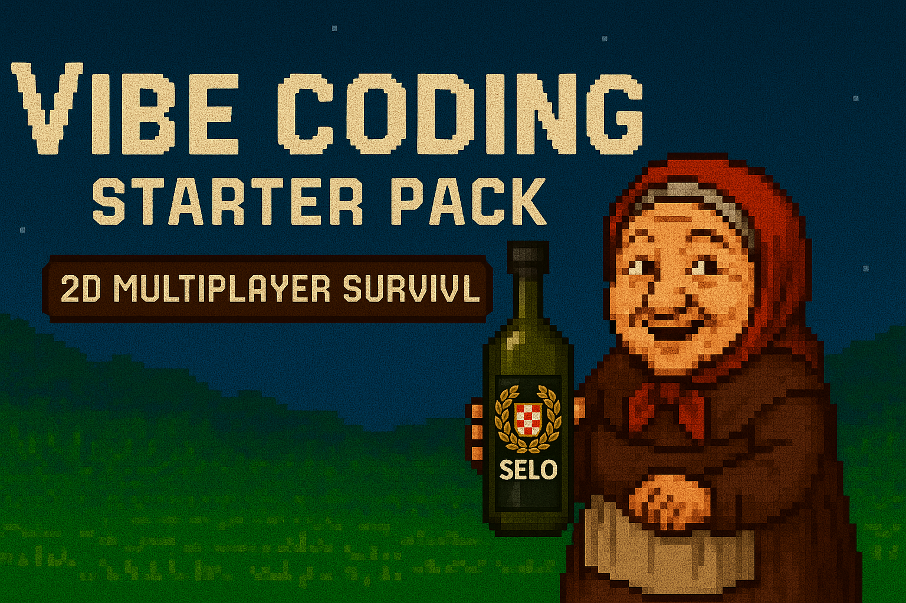

# Vibe Coding Starter Pack: 2D Survival Multiplayer


A lightweight 2D multiplayer survival game starter kit built with modern web technologies. Create interactive survival experiences with persistent player state, real-time multiplayer synchronization, and modular game logic.


## Table of Contents

*   [🗺️ Roadmap](#️-roadmap)
*   [🛠️ Tech Stack](#️-tech-stack)
*   [🔐 Authentication Setup](#-authentication-setup)
*   [📜 Cursor Rules & Code Maintainability](#-cursor-rules--code-maintainability)
*   [⚙️ Client Configuration](#️-client-configuration)
*   [🌍 World Configuration](#-world-configuration-tile-size--map-dimensions)
*   [📁 Project Structure](#-project-structure)
*   [🚀 Running the Project Locally](#-running-the-project-locally)
*   [🔧 Troubleshooting Local Setup](#-troubleshooting-local-setup)
*   [🔄 Development Workflow](#-development-workflow)
*   [🤝 Contributing](#-contributing)
*   [📜 License](#-license)

## 🗺️ Roadmap

**Completed (✅):**
*   Real-time Multiplayer: Basic player movement synchronization
*   Environment Systems: Day/night cycle, Full moon nights
*   Survival Mechanics: Basic resource harvesting (wood/stone/mushrooms)
*   Resource Respawning: Trees, Stones, Mushrooms
*   Survival Systems: Health, Hunger, Thirst, Warmth, Death/Respawn
*   World Discovery: Minimap
*   Hotbar/Basic UI: Item selection, basic layout
*   Inventory Management: Moving, swapping, stacking, stack splitting
*   Item Equipping: Tools/Weapons (Hotbar), Armor (Slots)
*   Placeables: Campfire (Multi-slot placement & interaction)
*   Crafting System: Item recipes
*   Storage Containers (Chests)
*   Looting Mechanics (Containers)

**In Progress (🚧):**
*   Performance Optimizations: Viewport culling, collision system improvements
*   Code Refactoring: Breaking down large modules into smaller, more maintainable components
*   Scaling Improvements: Optimizing data structures and algorithms for larger player counts
*   Entity Component System: Laying groundwork for more efficient entity management
*   Network Optimization: Reducing bandwidth usage through delta updates and prioritization

**Planned (📓):** 
*   **Core Systems & World:**
    *   Authentication/Account System
    *   World Generation: Procedural generation, biomes, monuments
    *   Terrain Autotiling: Edge detection, Wang tiles, seamless transitions between biomes
    *   Advanced AI: Enemy behaviors, pathfinding
    *   Team/Social Features
*   **Gameplay Loops & Interaction:**
    *   Construction System: Base building (walls, floors, etc.)
    *   Farming System: Planting, growing, harvesting crops
    *   Cooking System: Preparing food using campfire
*   **Combat & Items:**
    *   Combat Improvements: New weapon types (melee, hybrid, ranged), improved hit detection, PvP balancing
    *   Tool/Weapon Durability
    *   More Item Variety: Expanded tools, weapons, armor, resources, consumables

## 🛠️ Tech Stack

| Layer       | Technologies                |
|-------------|----------------------------|
| Frontend    | React 19, Vite 6, TypeScript |
| Multiplayer | SpacetimeDB                |
| Backend     | Rust (WebAssembly)         |
| Development | Node.js 22+                |

## 🔐 Authentication Setup

This project implements user authentication using Supabase, bridged to SpacetimeDB via a custom authentication microservice.

**Approach:**

1.  **Client:** Handles user login/signup with Supabase (using email/password, OAuth, etc.), obtaining a Supabase `access_token` (JWT).
2.  **Client:** Sends the Supabase `access_token` to the custom `auth-server`'s `/verify` endpoint.
3.  **Auth Server (`auth-server/`):** A separate Rust/Axum server that:
    *   Receives the Supabase token.
    *   Verifies the token's signature and claims using the **Supabase JWT Secret** (HS256 verification). *Note: We initially tried verifying using Supabase's public keys (RS256/JWKS), but encountered persistent 404 errors when fetching the keys/OIDC config. Using the shared secret is a reliable workaround.* 
    *   If valid, mints a new, short-lived JWT signed with a **different** shared secret (`SPACETIME_SECRET`) using HS256.
4.  **Client:** Receives the newly minted SpacetimeDB-compatible token from the `auth-server`.
5.  **Client:** Connects to the main SpacetimeDB game server (`server/`) using this new token.
6.  **SpacetimeDB Server (`server/`):** Verifies the token using the same `SPACETIME_SECRET` (provided via environment variable/startup flag) and grants the connection access based on the identity in the token.

This bridge is necessary because SpacetimeDB (when using shared secret authentication) expects HS256 tokens, while Supabase primarily issues RS256 tokens, and fetching Supabase's public keys proved unreliable in this setup.

### Running Authentication Locally

To get authentication working during local development, follow these steps:

1.  **Supabase Project:** Ensure you have a Supabase project set up. Enable the authentication providers you need (e.g., Email/Password, Google) in your Supabase dashboard.

2.  **Configure Auth Server (`auth-server/.env`):**
    *   Navigate to the `auth-server` directory.
    *   Create a file named `.env`.
    *   Add the following environment variables, replacing placeholders with your actual Supabase credentials:
        ```env
        # REQUIRED: Your Supabase project URL (without trailing slash)
        # Found in: Supabase Dashboard -> Project Settings -> API -> Project URL
        SUPABASE_PROJECT_URL=https://your-project-ref.supabase.co

        # REQUIRED: Your Supabase Anon Key (public)
        # Found in: Supabase Dashboard -> Project Settings -> API -> Project API keys -> anon public
        SUPABASE_ANON_KEY=your_supabase_anon_key_here

        # REQUIRED: Your Supabase JWT Secret
        # Found in: Supabase Dashboard -> Project Settings -> API -> JWT Settings -> Secret
        # Treat this like a password! Used to verify incoming Supabase tokens.
        SUPABASE_JWT_SECRET=your_supabase_jwt_secret_here

        # REQUIRED: A strong secret key used to sign the tokens SENT TO SpacetimeDB.
        # Must match the secret used by the main SpacetimeDB server.
        # Generate a strong, random string for this.
        SPACETIME_SECRET=generate_a_different_strong_secret_here

        # OPTIONAL: How long the SpacetimeDB token should be valid (in minutes)
        # Defaults to 240 (4 hours) if not set
        # TOKEN_TTL_MINUTES=240

        # OPTIONAL: The IP address and port to bind the auth server to
        # Defaults to 0.0.0.0:4000 if not set
        # BIND_ADDR=127.0.0.1:4000
        ```

3.  **Run Auth Server:**
    *   Open a terminal in the `auth-server/` directory.
    *   Run `cargo run`.
    *   Keep this terminal running. You should see `Auth-server listening on http://0.0.0.0:4000`. Logs for token verification will appear here.

4.  **Configure & Run Main SpacetimeDB Server (`server/`):**
    *   The main SpacetimeDB server needs to know the `SPACETIME_SECRET` (the one you generated for the `.env` file above) to verify tokens from the `auth-server`.
    *   **Set Environment Variable:** Set the `SPACETIME_IDENTITY_SIGNING_SECRET` environment variable to match the `SPACETIME_SECRET` from the `auth-server/.env` file.
        *   **Windows (PowerShell - Persistent User Variable):**
            ```powershell
            # Run PowerShell (as admin if needed)
            [Environment]::SetEnvironmentVariable("SPACETIME_IDENTITY_SIGNING_SECRET", "your_spacetime_secret_here", "User")
            # Close and reopen terminal
            ```
        *   **Linux/macOS (Bash/Zsh - Add to ~/.bashrc, ~/.zshrc, etc.):**
            ```bash
            echo 'export SPACETIME_IDENTITY_SIGNING_SECRET="your_spacetime_secret_here"' >> ~/.bashrc # Or ~/.zshrc
            source ~/.bashrc # Or source ~/.zshrc, or restart terminal
            ```
        *   **(Temporary - Set for current session only):**
            ```powershell
            # PowerShell
            $env:SPACETIME_IDENTITY_SIGNING_SECRET = "your_spacetime_secret_here"
            ```
            ```bash
            # Bash/Zsh
            export SPACETIME_IDENTITY_SIGNING_SECRET="your_spacetime_secret_here"
            ```
    *   **Run SpacetimeDB:** Open a *new* terminal (if you set the variable persistently) or use the *same* terminal (if set temporarily) and run:
        ```bash
        spacetime start
        ```
        *(If using Docker, pass it as `-e SPACETIME_IDENTITY_SIGNING_SECRET="your_spacetime_secret_here"` instead)*.
    *   Keep this terminal running.

5.  **Client Configuration:** No changes are needed in the client code. The `AuthContext.tsx` is already configured to contact the auth server at `http://localhost:4000/verify`.

6.  **Run Client:**
    *   Open a terminal in the project **root** directory.
    *   Run `npm run dev`.

Now, when you sign in via the client's login screen, the full authentication flow should execute.

### Production Deployment

*   **Auth Server:** Deploy the `auth-server` binary to a hosting provider (e.g., Fly.io, Render, Cloud Run). Configure the required environment variables securely within the hosting provider's settings. Ensure it's served over HTTPS.
*   **Client:** Update the `fetch` URL in `client/src/contexts/AuthContext.tsx` to point to your *deployed* auth server's `/verify` endpoint (using HTTPS).
*   **SpacetimeDB:** Configure your SpacetimeDB Maincloud/Enterprise instance with the *same* `SPACETIME_SECRET` used by your deployed auth server (via instance settings or cluster configuration).

### Limitations & Future Improvements

*   **HS256 Verification:** Using the Supabase JWT Secret is functional but less standard than RS256 public key verification. Ideally, the issues preventing JWKS fetching would be resolved, or SpacetimeDB would gain direct OIDC/RS256 support.
*   **No Refresh Token Handling:** This setup relies on the Supabase client library to manage token refreshes. The `AuthContext` fetches a new SpacetimeDB token whenever the Supabase token changes. A server-side refresh flow isn't implemented.

## 📜 Cursor Rules & Code Maintainability

### Cursor Rules (`.cursor/rules/`)

This project utilizes [Cursor](https://cursor.sh/)'s AI features, including **Rules**, to aid development. Rules are markdown files (`.mdc`) that provide context and guidelines to the AI assistant.
*   `guide.mdc`: Contains general architectural guidelines, technology choices, and development workflow information.
*   `resources.mdc`: Outlines the specific steps for adding new resources or gatherable nodes consistently.

As the project grows, more specific rules will be added for core features (e.g., crafting, building, combat) to ensure the AI can provide consistent and relevant assistance.

### Code Maintainability

While the project is still evolving, a key goal is maintainability. As features are added, we aim to:
*   Keep individual file sizes manageable (ideally under ~600 lines where practical).
*   Refactor logic into reusable helper functions and potentially dedicated modules (like the planned `inventory_logic.rs`).
*   Utilize abstraction to avoid code duplication, especially for common interactions like container management.

## ⚙️ Client Configuration

### Game Parameters (`client/src/config/gameConfig.ts`)

This file centralizes client-side values needed primarily for rendering the game world. 
The server uses its own authoritative values for game logic. Modifying these client values only affects local visuals.

*   `tileSize`: Visual pixel size for grid tiles.
*   `worldWidth`, `worldHeight`: Visual dimensions of the world grid (in tiles).
*   `spriteWidth`, `spriteHeight`: Pixel dimensions of a single sprite frame for rendering.

### SpacetimeDB Connection (`client/src/App.tsx`)

To connect the client to your SpacetimeDB instance, configure the following constants near the top of `client/src/App.tsx`:

```typescript
const SPACETIME_DB_ADDRESS = 'ws://localhost:3000';
const SPACETIME_DB_NAME = 'vibe-survival-game';
```

*   **For Local Development:** Use the default values (`ws://localhost:3000` and your module name).
*   **For Maincloud Deployment:** Replace `SPACETIME_DB_ADDRESS` with your Maincloud WebSocket URI (e.g., `wss://maincloud.spacetimedb.net`) and `SPACETIME_DB_NAME` with your Maincloud database name (e.g., `your-identity/your-database-name`).

## 🌍 World Configuration (Tile Size & Map Dimensions)

Changing the tile size or the overall world dimensions requires modifications in **both** the client and server code to ensure consistency between rendering, collision detection, and game logic.

1.  **Client (`client/src/config/gameConfig.ts`):**
    *   Modify the `TILE_SIZE` constant at the top of the file.
    *   Modify the `worldWidth` and `worldHeight` properties within the exported `gameConfig` object (these define dimensions in *tiles*).
    *   Other values like `minimapGridCellDiagonalTiles` might also need tuning depending on the new world size.

2.  **Server (`server/src/lib.rs`):**
    *   Modify the `TILE_SIZE_PX` constant.
    *   Modify the `WORLD_WIDTH_TILES` constant.
    *   Modify the `WORLD_HEIGHT_TILES` constant.

**Important:** Ensure the `TILE_SIZE` / `TILE_SIZE_PX` and the `worldWidth`/`Height` / `WORLD_WIDTH`/`HEIGHT_TILES` values are kept consistent between the client and server configuration files.

After making server-side changes, remember to **re-publish** the module:

```bash
# From the server/ directory
spacetime publish vibe-survival-game
# No need to regenerate client bindings for changing only these constants
```

## 📁 Project Structure

```
vibe-coding-starter-pack-2d-survival/
├── .cursor/        # Cursor AI configuration
│   └── rules/      # *.mdc rule files for AI context
├── client/         # React frontend (UI, rendering, input)
│   ├── public/     # Static files (index.html, favicons)
│   ├── src/
│   │   ├── assets/ # Sprites, textures, sounds
│   │   ├── components/ # React components (UI, Canvas)
│   │   ├── config/     # Client-side game configuration
│   │   ├── generated/  # Auto-generated SpacetimeDB bindings
│   │   ├── hooks/      # Custom React hooks
│   │   ├── types/      # Shared TypeScript types (e.g., drag/drop)
│   │   └── utils/      # Helper functions (rendering, logic)
│   └── package.json
├── server/         # SpacetimeDB server logic (Rust)
│   ├── src/        # Server code (lib.rs, modules)
│   └── Cargo.toml
├── github.png      # Banner image
├── preview.png     # Gameplay preview image
├── README.md
└── LICENSE
```

## 🚀 Running the Project Locally

This guide assumes you have installed the prerequisites: Node.js v22+, Rust, and the SpacetimeDB CLI.

1.  **Clone the Repository:**
    ```bash
    git clone https://github.com/SeloSlav/vibe-coding-starter-pack-2d-multiplayer-survival.git
    cd vibe-coding-starter-pack-2d-multiplayer-survival
    ```

2.  **Install Client Dependencies:**
    ```bash
    # From the project root directory
    npm install
    ```

3.  **Start Local SpacetimeDB Server:**
    Open a **separate terminal** window and run:
    ```bash
    spacetime start
    ```
    Keep this terminal running in the background. It hosts your local game database.

4.  **Build, Publish Server Module & Generate Client Bindings:**
    Open **another terminal** window, navigate to the `server` directory, and run these commands:
    ```bash
    cd server
    spacetime publish vibe-survival-game
    spacetime generate --lang typescript --out-dir ../client/src/generated
    ```
    *   **Note:** You need to re-run these two commands *every time* you change the server schema (e.g., modify tables or reducers in `server/src/lib.rs` or other `.rs` files).

5.  **Run the Client:**
    In the **same terminal** as step 4 (or a new one, just make sure you are in the project root directory `vibe-coding-starter-pack-2d-survival`), run:
    ```bash
    npm run dev
    ```

6.  **Access the Game:**
    Open your browser and navigate to the local address provided by Vite (usually `http://localhost:5173` or similar).

## 🔧 Troubleshooting Local Setup

*   **`Cannot find module './generated'` error in client:**
    *   Ensure you ran `spacetime generate --lang typescript --out-dir ../client/src/generated` from the `server` directory *after* the last `spacetime publish` was **successful**. Check the publish output for errors.
    *   Make sure the `client/src/generated` folder was actually created and contains `.ts` files, including `index.ts`.
    *   Restart the Vite dev server (`npm run dev`). Sometimes Vite needs a restart after significant file changes.
*   **Client connects but game doesn't load / players don't appear:**
    *   Check the browser console (F12) for JavaScript errors (e.g., subscription failures, rendering issues).
    *   Check the terminal running `spacetime start` for server-side Rust errors (e.g., reducer panics, assertion failures).
*   **Old players/data still appearing after disconnect/refresh:**
    *   Verify the `identity_disconnected` logic in `server/src/lib.rs` is correctly deleting the player, inventory, and equipment.
    *   For a guaranteed clean slate during development, delete and recreate the local database:
        ```bash
        # Stop spacetime start (Ctrl+C in its terminal)
        spacetime delete vibe-survival-game # Run from any directory
        spacetime start # Restart the server
        # Then re-publish and re-generate (Step 4 above)
        ```
*   **`spacetime publish` tries to publish to Maincloud instead of local:**
    *   Ensure you are logged out: `spacetime logout`.
    *   Ensure the `spacetime start` server is running *before* you publish.
    *   Check your SpacetimeDB config file (`%LOCALAPPDATA%/SpacetimeDB/config/cli.toml` on Windows, `~/.local/share/spacetime/config/cli.toml` on Linux/macOS) and make sure `default_server` is set to `local` or commented out.

## 🔄 Development Workflow

1.  **Server Development (`server/src`)**:
    *   Modify Rust code (add features, fix bugs).
    *   **If schema changes (tables, reducer signatures):**
        1.  Run `spacetime publish vibe-survival-game` (from `server/`).
        2.  Run `spacetime generate --lang typescript --out-dir ../client/src/generated` (from `server/`).
    *   **If only logic changes (no schema impact):**
        1.  Run `spacetime publish vibe-survival-game` (from `server/`). (Generate is not strictly needed but doesn't hurt).
2.  **Client Development (`client/src`)**:
    *   Modify React/TypeScript code.
    *   The Vite dev server (`npm run dev`) usually provides Hot Module Replacement (HMR) for fast updates. If things seem broken after large changes, try restarting the dev server.

## 🤝 Contributing

We welcome contributions to this project! To contribute, please follow the standard GitHub Fork & Pull Request workflow:

1.  **Fork the Repository**: Click the 'Fork' button on the top right of the main repository page (`SeloSlav/vibe-coding-starter-pack-2d-multiplayer-survival`) to create your personal copy under your GitHub account.
2.  **Clone Your Fork**: Clone *your forked repository* to your local machine:
    ```bash
    git clone https://github.com/YOUR_USERNAME/vibe-coding-starter-pack-2d-multiplayer-survival.git
    cd vibe-coding-starter-pack-2d-multiplayer-survival
    ```
    (Replace `YOUR_USERNAME` with your actual GitHub username).
3.  **Create a Branch**: Create a new branch for your feature or fix:
    ```bash
    git checkout -b feature/your-feature-name
    ```
4.  **Implement Your Changes**: Make your code changes, following project style guidelines.
5.  **Test Thoroughly**: Ensure your changes work as expected and don't break existing functionality.
6.  **Commit Your Changes**: Commit your work with a clear message:
    ```bash
    git commit -m "feat: Add awesome new feature"
    ```
7.  **Push Your Branch**: Push your changes *to your fork*:
    ```bash
    git push origin feature/your-feature-name
    ```
8.  **Open a Pull Request**: Go back to the *original* repository (`SeloSlav/vibe-coding-starter-pack-2d-multiplayer-survival`) on GitHub. You should see a prompt to create a Pull Request from your recently pushed branch. Click it, or navigate to the "Pull Requests" tab and click "New Pull Request".
9.  **Configure the PR**: Ensure the base repository is `SeloSlav/vibe-coding-starter-pack-2d-multiplayer-survival` and the base branch is typically `main` (or the relevant development branch). Ensure the head repository is your fork and the compare branch is your feature branch (`feature/your-feature-name`).
10. **Describe Your Changes**: Provide a clear title and description for your Pull Request, explaining the changes and their purpose.

Whether you're interested in adding new gameplay mechanics, improving existing systems, or enhancing the codebase, your contributions are valuable to making this starter pack even better!

For questions or discussions about potential contributions, feel free to open an issue first to discuss your ideas.

## 📜 License

This project is licensed under the MIT License - see the LICENSE file for details.

---

Created by SeloSlav
